# Kafka-Spring-cloud-Stream

## Using KAFKA and Stpring Cloud Streams:
1) Initializing Kafka Ecosystem: Zookeeper, Kafka Server, and Testing
- Start Zookeeper
- Start Kafka-server
- Testing with Kafka-console-producer and kafka-console-consumer

2) With Docker
- docker-compose.yml file
 - Starting docker containers: zookeeper and kafka-broker
 - Testing with Kafka-console-producer and kafka-console-consumer
3) Using KAFKA and Stpring Cloud Streams,
- A KAFKA Service Producer via a Rest Controller
- A KAFKA Service Consumer
- A KAFKA Supplier Service
- A Real Time Stream Processing Data Analytics Service with Kaflka Streams
- A Web application that displays Stream Data Analytics results in real time
## Screenshots
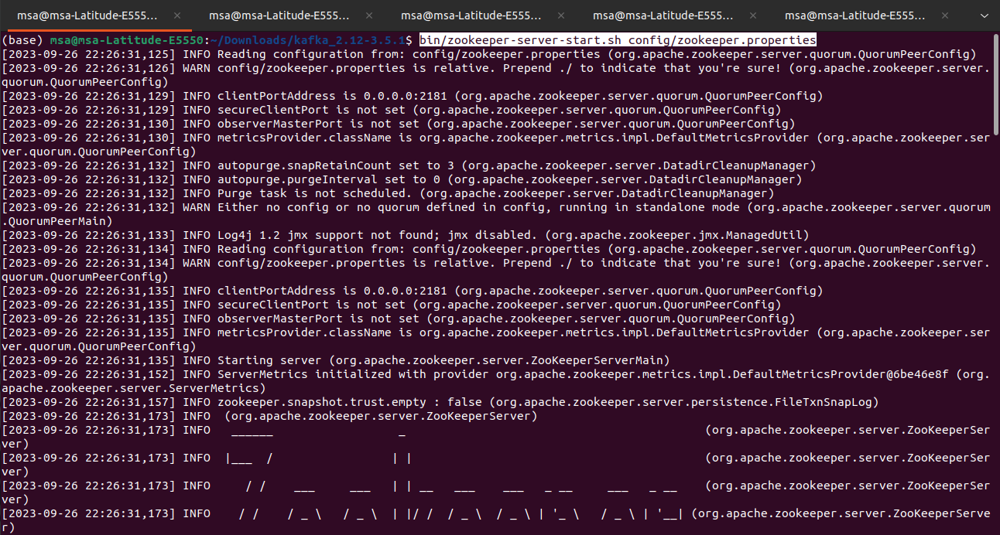
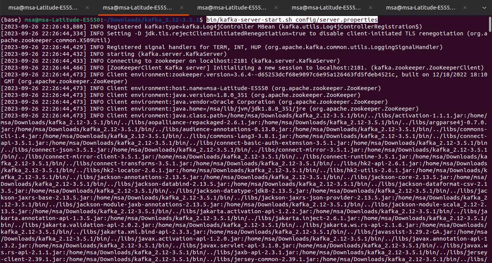
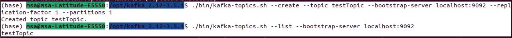
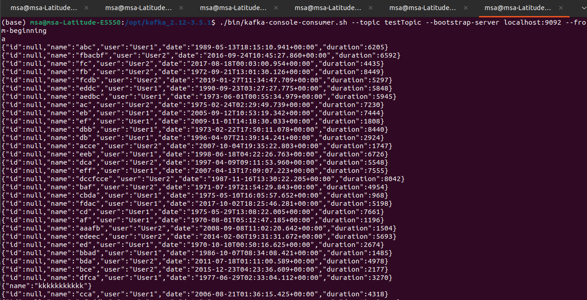

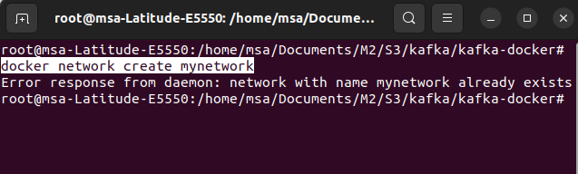
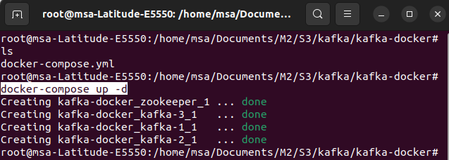
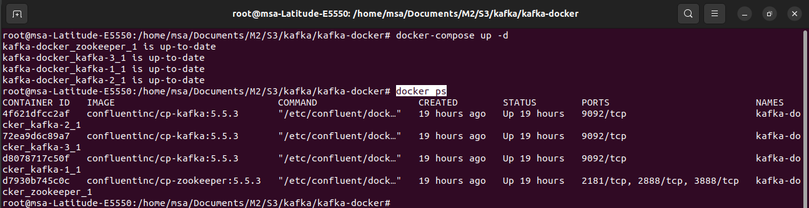
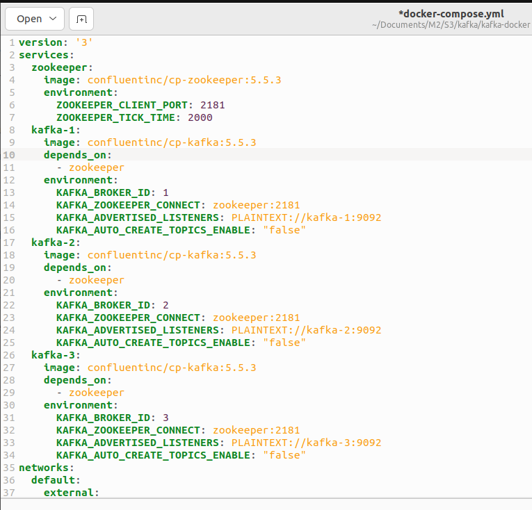

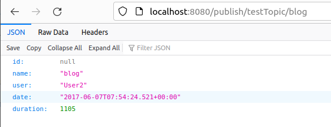
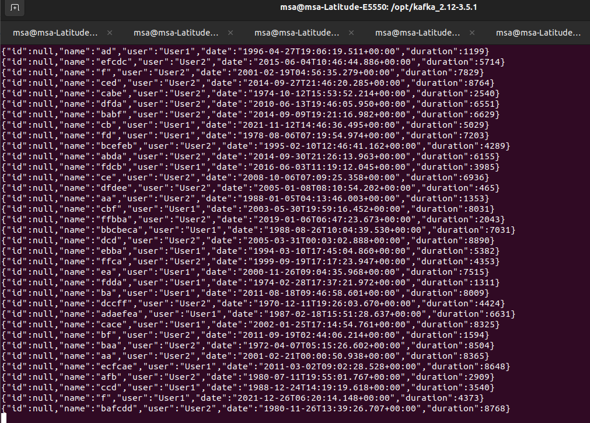
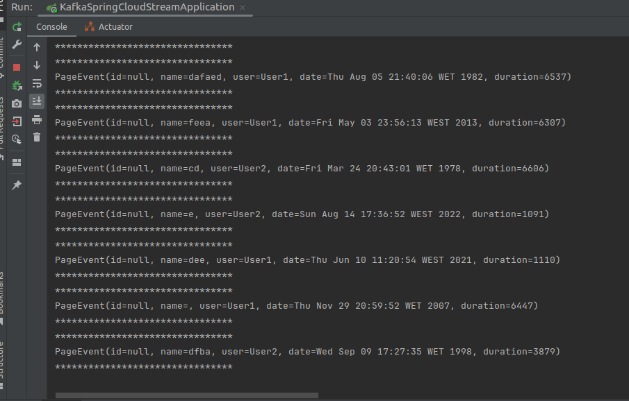

